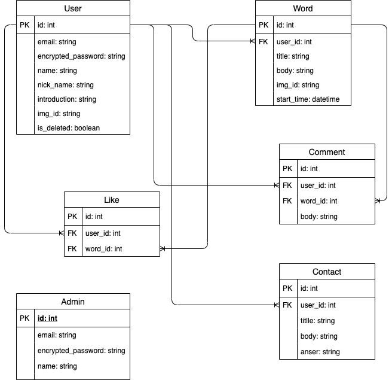

# ひとこと日記

## サイト概要

今日あった出来事を「ひとこと」で書き込む日記帳。
誰でも「ひとこと」に対して'いいね'や'コメント'で反応することができます。
見せたくない日記は非公開にすることもできます。

### サイトテーマ

誰でも続けられる日記。

### テーマを選んだ理由

継続することが苦手で三日坊主な人でも続けられる日記を考えた結果、
**「ひとこと」**
なら続けられるのではないかと思いこのテーマを選定しました。

### ターゲットユーザ

日記を続けられなかった人。

### 主な利用シーン

就寝前、起床後、気が向いたとき。

## 設計書

### 機能一覧

[チャレンジ要素一覧(クラウド教養コース)](https://docs.google.com/spreadsheets/d/1gAUX7nUgGQcHxTco8k9G9bPhlAolf_Xa7C8ZmYxR2YY/edit?usp=sharing)  
基本的にはbookers2のワイヤーフレームを骨格にしてカレンダー機能等を付け足していく予定です。

## 開発環境

- OS：Linux(CentOS)
- 言語：HTML,CSS,JavaScript,Ruby,SQL
- フレームワーク：Ruby on Rails 5.2.4.3
- JS ライブラリ：jQuery
- 仮想環境：Vagrant,VirtualBox
